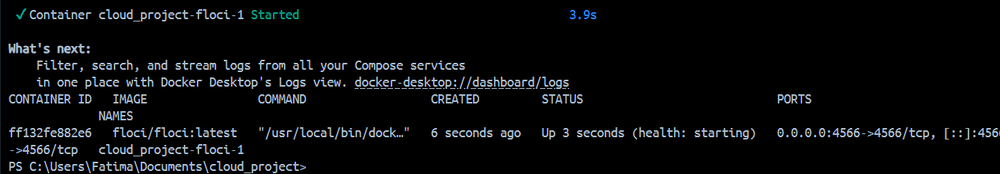
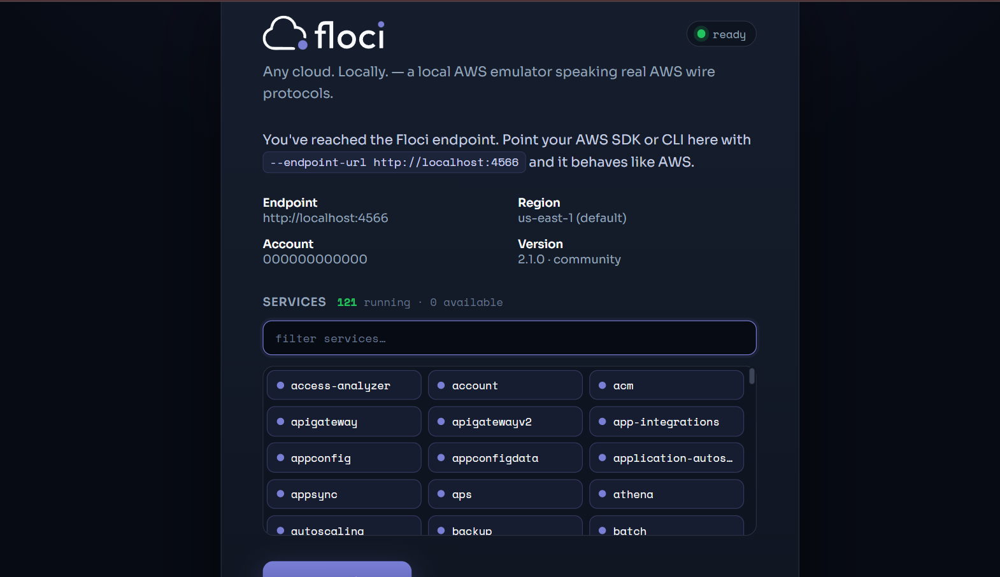
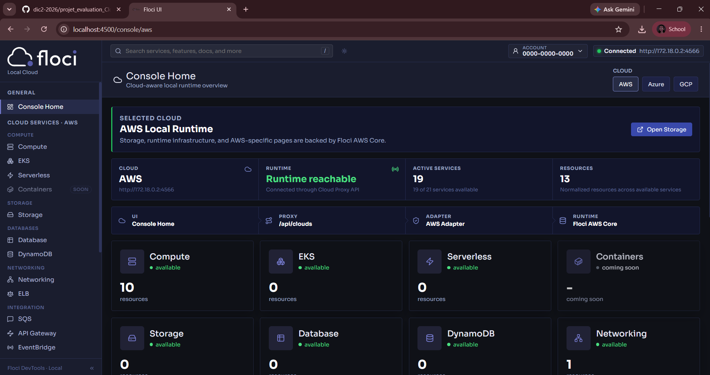
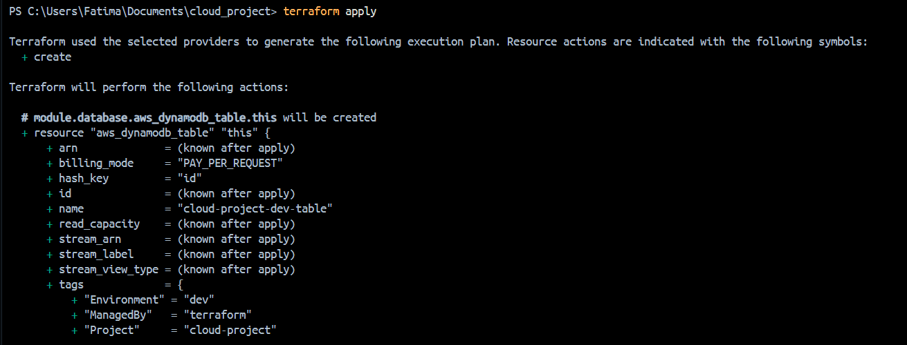
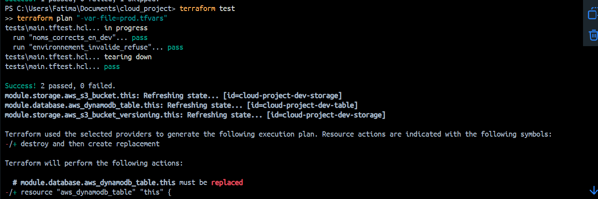
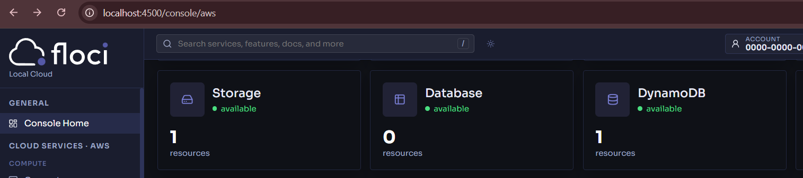
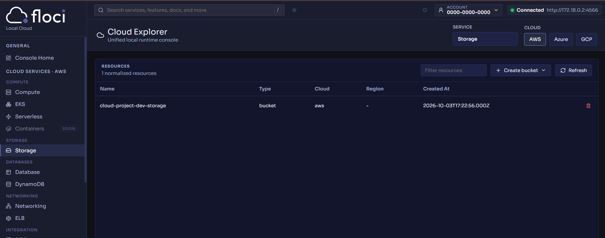
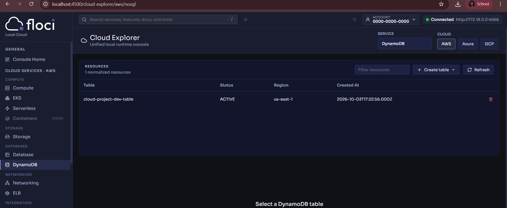
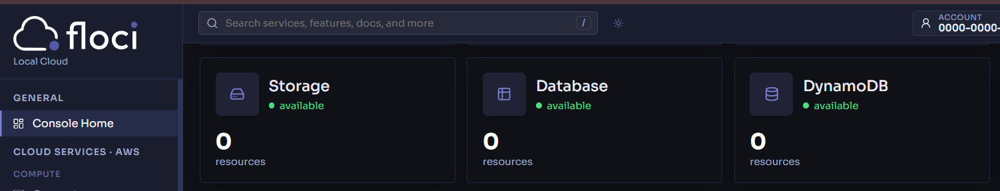
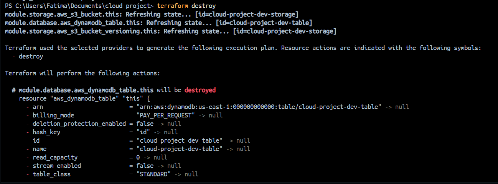

# Projet d'évaluation : Cloud, Floci et Terraform

Ce projet déploie deux services AWS avec Terraform sur un Cloud local émulé par Floci, puis les détruit proprement. Il a été réalisé sous Windows (PowerShell) avec Docker Desktop.

## 1. Provider choisi

Le provider choisi est **AWS**. Floci propose une famille d'émulateurs (AWS, Azure, GCP, OCI), chacun sur son propre port. L'émulateur AWS écoute sur le port **4566**. Les autres émulateurs n'ont pas été lancés : dans Floci UI, les onglets Azure et GCP affichent donc "not connected", ce qui est normal.

## 2. Services choisis

1. **S3** (stockage d'objets), géré par le module `modules/storage`.
2. **DynamoDB** (base de données NoSQL), géré par le module `modules/database`.

## 3. Pourquoi ces services

S3 et DynamoDB sont deux services fondamentaux d'AWS et ils se complètent : l'un stocke des fichiers, l'autre des données structurées. Ils sont émulés directement par Floci, sans conteneur supplémentaire, ce qui rend le projet léger et facile à reproduire. Ils sont aussi bien supportés par le provider Terraform AWS, et permettent de montrer deux modules indépendants avec leurs propres variables et sorties.

## 4. Prérequis

Docker, Terraform en version 1.10 ou plus, et Git.

```powershell
docker --version
terraform version
git --version
```

## 5. Lancer Floci

Le fichier `compose.yaml` à la racine du projet décrit le conteneur Floci. Il publie le port 4566 et monte le socket Docker, ce qui est nécessaire pour que Floci puisse démarrer l'interface Floci UI.

```powershell
docker compose up -d
docker ps
```

La page d'accueil de l'émulateur répond ensuite sur `http://localhost:4566` et affiche l'état "ready".





## 6. Lancer Floci UI

Floci UI est démarrée à la demande par Floci, dans un conteneur séparé. Il suffit d'ouvrir l'adresse suivante, ou de cliquer sur "Open Floci UI" depuis la page d'accueil :

```text
http://localhost:4566/_floci/ui
```

Au premier accès, l'image de l'interface est téléchargée, puis le navigateur est redirigé vers `http://localhost:4500/console/aws`. Dans la console, le provider AWS est sélectionné et le menu de gauche donne accès aux services Storage (S3) et DynamoDB, qui sont les deux services utilisés dans ce projet.



## 7. Configurer Terraform pour utiliser Floci

Le fichier `providers.tf` redirige le provider AWS vers Floci au lieu du vrai AWS :

1. les endpoints de `s3`, `dynamodb`, `sts` et `iam` pointent vers `http://localhost:4566` (variable `floci_endpoint`) ;
2. les credentials sont factices (`test` et `test`), Floci accepte toute valeur non vide ;
3. `skip_credentials_validation`, `skip_metadata_api_check` et `skip_requesting_account_id` évitent tout appel vers le vrai AWS ;
4. `s3_use_path_style = true` adresse les buckets sous la forme `localhost:4566/nom_du_bucket`.

### Différence entre Terraform sur le vrai AWS et Terraform sur Floci

* **Le code des ressources ne change pas.** Les blocs `aws_s3_bucket` et `aws_dynamodb_table` sont identiques dans les deux cas.
* **Seule la configuration du provider change** : endpoints locaux, fausses credentials et vérifications de compte désactivées.
* **Avec le vrai AWS**, les requêtes partent vers les services réels, avec de vraies clés IAM, et les ressources sont facturées et persistantes.
* **Avec Floci**, tout reste sur la machine, sans compte, sans coût et sans risque. Les données sont en mémoire par défaut et disparaissent à l'arrêt du conteneur.

## 8. Structure du projet

```text
cloud-project/
├── README.md
├── compose.yaml
├── main.tf
├── providers.tf
├── variables.tf
├── locals.tf
├── outputs.tf
├── versions.tf
├── terraform.tfvars
├── prod.tfvars
├── modules/
│   ├── storage/
│   │   ├── main.tf
│   │   ├── variables.tf
│   │   └── outputs.tf
│   └── database/
│       ├── main.tf
│       ├── variables.tf
│       └── outputs.tf
├── tests/
│   └── main.tftest.hcl
└── screenshots/
```

Rôle des éléments principaux :

* **Variables** (`variables.tf`) : `project_name`, `environment`, `aws_region`, `floci_endpoint`, `s3_versioning_enabled` et `dynamodb_hash_key`. Aucune valeur n'est écrite en dur dans les ressources.
* **terraform.tfvars** : fournit les valeurs de l'environnement dev. Il est chargé automatiquement par Terraform.
* **Locals** (`locals.tf`) : `resource_prefix` vaut `project_name` suivi de `environment`, et `common_tags` regroupe les tags communs. Le préfixe est utilisé pour nommer le bucket et la table.
* **Modules** : `storage` et `database` sont appelés depuis `main.tf` et reçoivent leurs valeurs uniquement par leurs variables, ce qui les rend réutilisables.
* **Outputs** : chaque module expose `resource_name` et `resource_arn`, et la racine les remonte sous les noms `storage_name`, `storage_arn`, `database_name` et `database_arn`.

## 9. Déploiement

Toutes les commandes se lancent depuis la racine du projet.

### Initialisation

```powershell
terraform init
```

### Mise en forme

```powershell
terraform fmt -recursive
```

### Validation

```powershell
terraform validate
```

### Plan

```powershell
terraform plan
```

### Application

```powershell
terraform apply
```

Terraform demande une confirmation : taper `yes`. Résultat obtenu :

```text
Apply complete! Resources: 3 added, 0 changed, 0 destroyed.

Outputs:

database_arn = "arn:aws:dynamodb:us-east-1:000000000000:table/cloud-project-dev-table"
database_name = "cloud-project-dev-table"
storage_arn = "arn:aws:s3:::cloud-project-dev-storage"
storage_name = "cloud-project-dev-storage"
```

Les trois ressources sont le bucket S3, la configuration de versioning du bucket et la table DynamoDB.



## 10. Bonus

### Validation avancée des variables

`project_name` doit respecter un format précis (3 à 30 caractères, minuscules, chiffres et tirets), et `environment` n'accepte que `dev` ou `prod`. Une valeur invalide est refusée avant toute création de ressource.

### Environnements dev et prod

Deux fichiers de valeurs existent : `terraform.tfvars` pour dev et `prod.tfvars` pour prod. L'environnement prod active en plus le versioning du bucket.

```powershell
terraform plan "-var-file=prod.tfvars"
```

### Tests Terraform

Le fichier `tests/main.tftest.hcl` contient deux tests. Le premier vérifie que les noms du bucket et de la table suivent le format attendu. Le second vérifie que la valeur `staging` pour `environment` est bien refusée.

```powershell
terraform test
```



### Documentation des modules avec terraform docs

```powershell
foreach ($m in "storage","database") {
  docker run --rm -v "${PWD}/modules/${m}:/ws" quay.io/terraform-docs/terraform-docs:latest markdown table /ws --output-file README.md --output-mode replace
}
```

Chaque module obtient ainsi un `README.md` généré automatiquement avec ses variables et ses sorties.

## 11. Vérifier les ressources dans Floci UI

Après `terraform apply`, ouvrir `http://localhost:4500/console/aws` et rafraîchir la page. Sur la Console Home, les compteurs Storage et DynamoDB passent de 0 à 1.



### Service 1 : S3

La page Storage affiche le bucket `cloud-project-dev-storage`.



### Service 2 : DynamoDB

La page DynamoDB affiche la table `cloud-project-dev-table`.



## 12. Destruction

```powershell
terraform destroy
```

Terraform demande une confirmation : taper `yes`. Il supprime les trois ressources.

### Preuve dans Floci UI

Après un rafraîchissement, les compteurs Storage et DynamoDB sont revenus à 0.



### Preuve dans PowerShell

La sortie `Destroy complete! Resources: 3 destroyed.` confirme la suppression, et `terraform state list` ne renvoie plus aucune ressource.

```powershell
terraform state list
```



## 13. Reproduire le projet

1. Installer Docker, Terraform (version 1.10 ou plus) et Git.
2. Cloner le dépôt et se placer dans le dossier du projet.
3. Lancer Floci avec `docker compose up -d`.
4. Ouvrir `http://localhost:4566/_floci/ui` pour démarrer Floci UI.
5. Lancer `terraform init`, `terraform validate`, `terraform plan` puis `terraform apply`.
6. Vérifier le bucket et la table dans Floci UI sur `http://localhost:4500/console/aws`.
7. Lancer `terraform destroy` et vérifier leur disparition.
8. Arrêter Floci avec `docker compose down`.

## 14. Remarques

* Floci stocke ses données en mémoire par défaut. Redémarrer le conteneur supprime donc les ressources, et il faut relancer `terraform apply`.
* Si `localhost:4500` ne répond pas, passer par `http://localhost:4566/_floci/ui`, qui redémarre le conteneur de l'interface. Le socket Docker doit être monté dans `compose.yaml`.
* Le fichier `.terraform.lock.hcl` est versionné pour figer la version du provider. Les dossiers `.terraform/` et les fichiers `*.tfstate` sont exclus par `.gitignore`.

## 15. Conclusion

Ce projet montre qu'une même configuration Terraform peut cibler un Cloud réel ou un Cloud local en changeant uniquement le provider. Floci a permis de déployer et de détruire un bucket S3 et une table DynamoDB sans compte ni coût, avec une configuration organisée en modules, variables, locals, outputs et fichiers tfvars, et vérifiée à chaque étape dans Floci UI.
